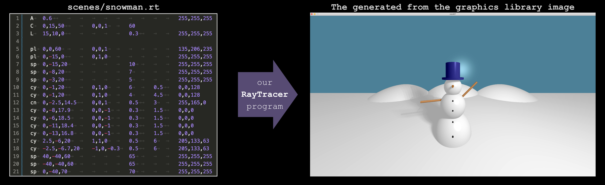
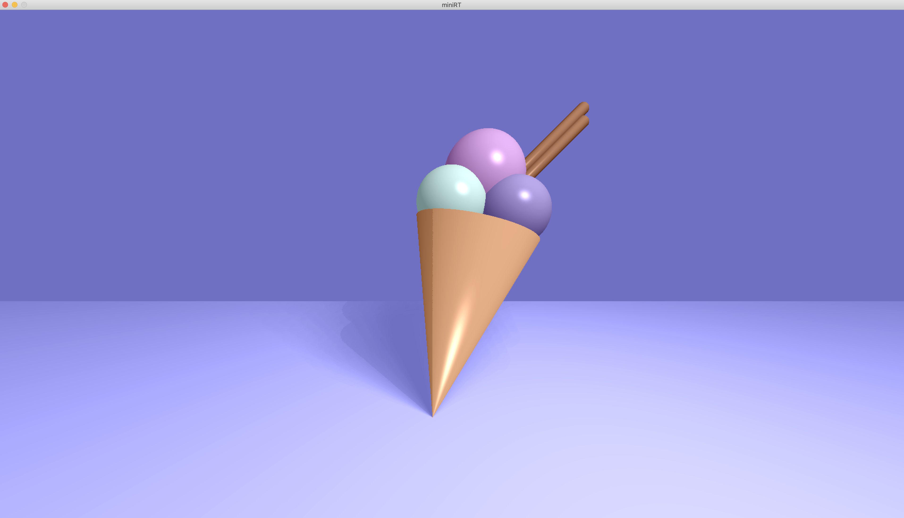
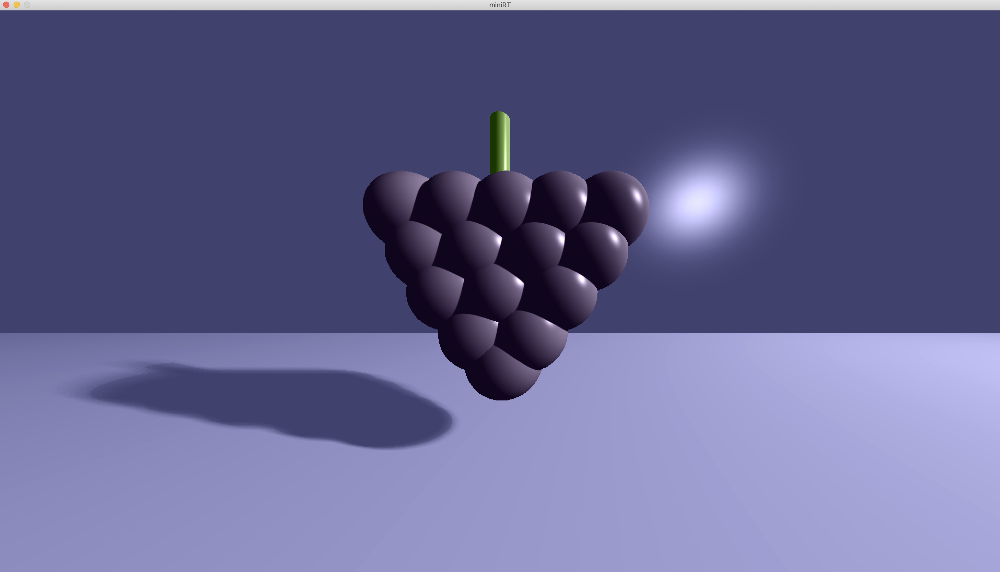
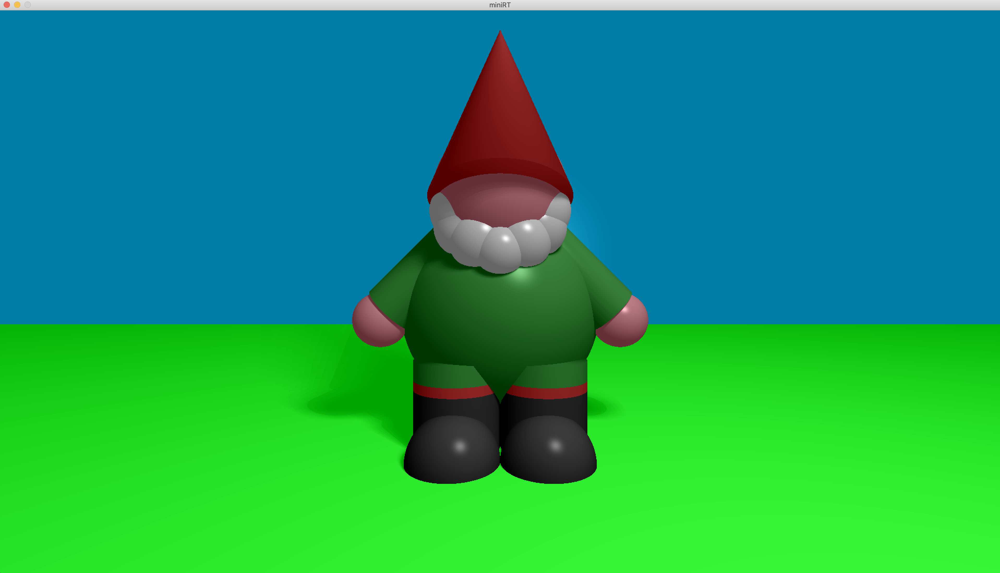
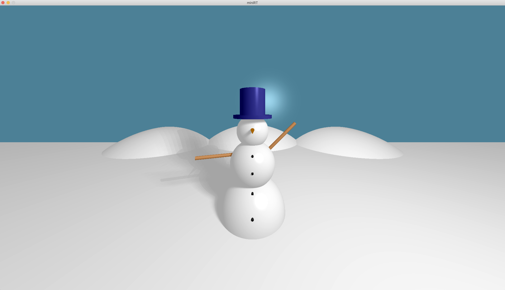
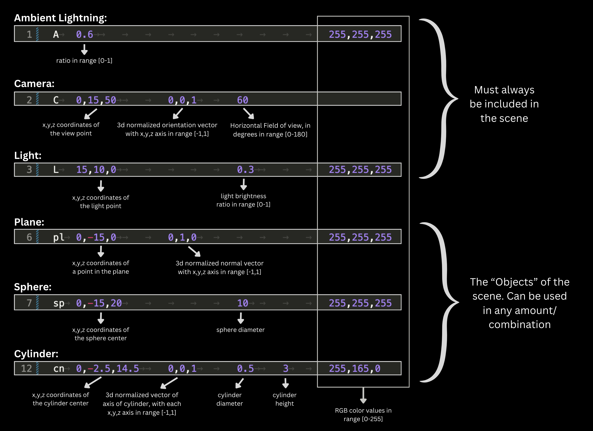

# 
# 
**miniRT**

# 
 A program coded in   in accordance with [The Norm](https://github.com/42School/norminette/blob/master/pdf/en.norm.pdf) of 42 School. 

>## 
 Team project created by: [Flavia](https://github.com/dendeaisd) & [Mary Kate](https://github.com/MaryKateEvan)  

> 

## 📝 Description
"_The goal of this project is to generate images using the **Raytracing protocol**. Those computer-generated images each represent a scene, as seen from a specific angle and position, defined by simple geometric objects, and each with its own lighting system._"

In simpler words, from a 'weird' **.rt file**, full of numbers that follow [_specific guidelines_](https://github.com/dendeaisd/MiniRT?tab=readme-ov-file#scene-decription-file-rt-requirements), we generate **images**, that represent the "scene" that the .rt file "describes":

Graphics Library that was used: [MLX42](https://github.com/codam-coding-college/MLX42)
  

## 👀 Preview:

`./miniRT scenes/icecream.rt HD`: 
  
`./miniRT scenes/grape.rt HD`: 
  
`./miniRT scenes/dwarf.rt HD`: 
  
`./miniRT scenes/snowman.rt HD`: 
  

## 🎯 Mandatory requirements:
> as specified in the [Subject](https://github.com/rphlr/42-Subjects/blob/main/common-core/miniRT/en.subject.pdf)

✔️ Handling of the three geometric objects: **plane** 🃏, **sphere** 🏀 and **cylinder** 🧨.  
✔️ Management of all possible **intersections** of the objects. 
✔️ **Resizing** of the object's unique properties: diameter for a sphere, width and height for a cylinder. 
✔️ Implementation of **Ambient** and **Diffuse lightning**. (Ambient so that the objects are never in the dark.)  
✔️ **Hard shadows** and **soft brightness**. 
✔️ The program displays the image in a window, which can be closed by clicking either **ESC** or the red cross on the window's frame. 
✔️ The program must take as first argument a scene description file with the **.rt** extension:

### &nbsp;&nbsp;&nbsp; Scene decription file (.rt) requirements:
- Each type of element can be separated by one or more line break(s).
- Each type of information from an element can be separated by one or more space(s), and/or tabs.
- Each type of element can be set in any order in the file.
- Elements which are defined by a capital letter (A,C,L) can only be declared once in the scene.
- Each element first’s information is the **type identifier** (composed by one or two character(s)), followed by all specific information for each object in a strict order as follows:

💡 **TIP**: You can create **any scene** you want, by following the above requirements and specified ranges for the numbers. 

### ❗ Error Handling:
> You can browse many cases of [invalid scene files](https://github.com/dendeaisd/MiniRT/tree/main/scenes/invalid) and run them according to the [Usage](https://github.com/dendeaisd/MiniRT?tab=readme-ov-file#-usage) instructions, to check the Error messages we provide.
- Running the program with more than 3 arguments, or less than 2.
- Empty or unexisting .rt file
- Wrong extension of file, like `.txt`
- Wrong element identifier (only `A`, `C`, `L`, `sp`, `pl`, `cy` are accepted)
- Duplicate or absent ambient lightning, camera or light
- Wrong number of arguments for some element(s) (for example, 8 numbers provided for the camera, instead of 7).
- RGB color values not in the integer range [0-255]
- Ambient Lightning Ratio not in the range [0-1]
- 3d normalized vectors with x,y,z axis not in the range [-1,1]
- Camera's field of view not in the range of [0-180] degrees
- Light brightness ratio not in the range of [0-1]   

## ⭐ Additional (bonus) features we added:

## ⚙️ Installation

## 🕹 Usage

## 🙌 &nbsp;Acknowledgements

- The files [`icecream.rt`](https://github.com/dendeaisd/MiniRT/blob/main/scenes/icecream.rt) and [`snowman.rt`](https://github.com/dendeaisd/MiniRT/blob/main/scenes/snowman.rt) are borrowed from the [oph-design/miniRT](https://github.com/oph-design/miniRT.git) authored by [oph-design](https://github.com/oph-design) and [LaurinUB](https://github.com/LaurinUB).
- Special Thanks also to [oph-design](https://github.com/oph-design) for the creation of our scene [`dwarf.rt`](https://github.com/dendeaisd/MiniRT/blob/main/scenes/dwarf.rt) 🙏
