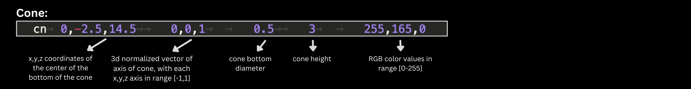
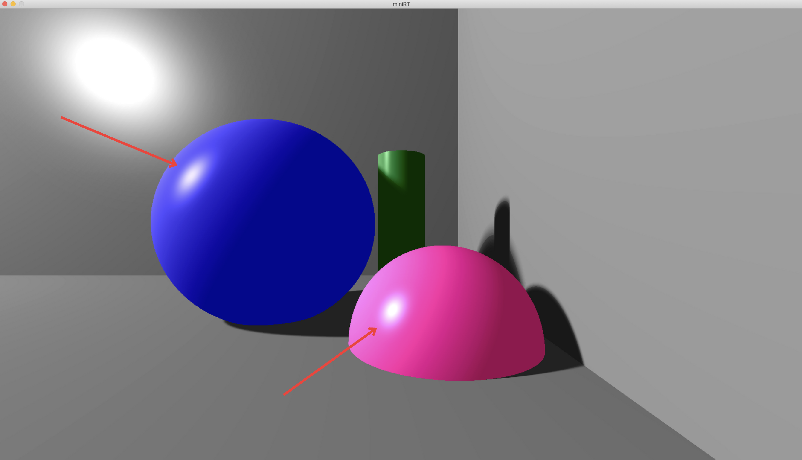
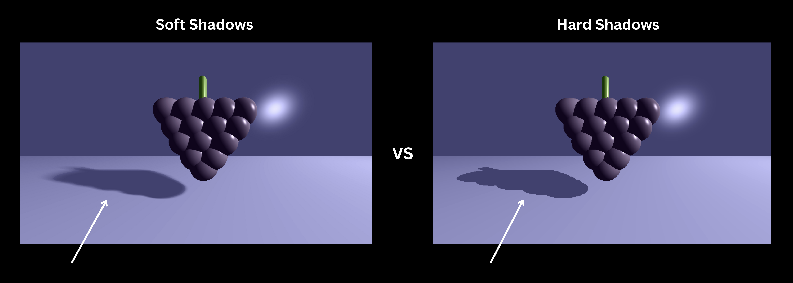
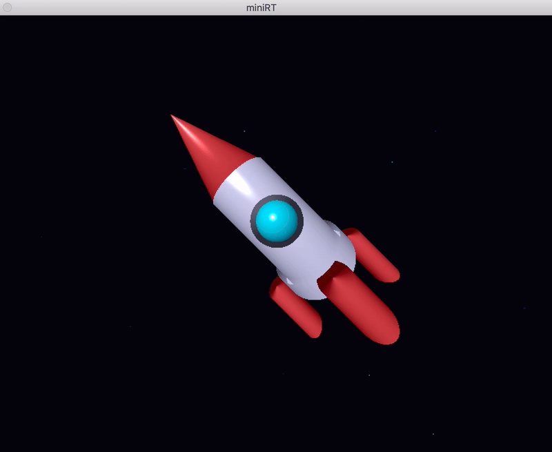
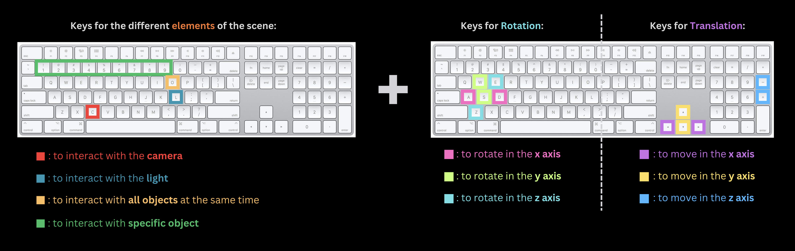

# 
# <p align="center">**miniRT**</p>
# <p align="center"> <sup>A program coded in </sup> [](https://skillicons.dev)<sup> in accordance with [The Norm](https://github.com/42School/norminette/blob/master/pdf/en.norm.pdf) of 42 School.</sup> </p>

>## <p align="center"> <sup>Team project created by: [Flavia](https://github.com/dendeaisd) & [Mary Kate](https://github.com/MaryKateEvan)  </sup></p>

> 

## 📝 Description
"_The goal of this project is to generate images using the **Raytracing protocol**. Those computer-generated images each represent a scene, as seen from a specific angle and position, defined by simple geometric objects, and each with its own lighting system._"

In simpler words, from a 'weird' **.rt file**, full of numbers that follow [_specific guidelines_](https://github.com/dendeaisd/MiniRT?tab=readme-ov-file#-scene-decription-file-scenert), we generate **images**, that represent the "scene" that the .rt file "describes":


Graphics Library that was used: [MLX42](https://github.com/codam-coding-college/MLX42)
<br><br>

## 👀 Preview:

`./miniRT scenes/icecream.rt HD`:<br>
<br><br>
`./miniRT scenes/grape.rt HD`:<br>
<br><br>
`./miniRT scenes/dwarf.rt HD`:<br>
<br><br>
`./miniRT scenes/snowman.rt HD`:<br>
<br><br>

## 🎯 Mandatory requirements:
> as specified in the [Subject](https://github.com/rphlr/42-Subjects/blob/main/common-core/miniRT/en.subject.pdf)

✔️ Handling of the three geometric objects: **plane** 🃏, **sphere** 🏀 and **cylinder** 🧨. <br>
✔️ Management of all possible **intersections** of the objects.<br>
✔️ **Resizing** of the object's unique properties: diameter for a sphere, width and height for a cylinder.<br>
✔️ Implementation of **Ambient** and **Diffuse lightning**. (Ambient so that the objects are never in the dark.) <br>
✔️ **Hard shadows** and **spot brightness**.<br>
✔️ The program displays the image in a window, which can be closed by clicking either **ESC** or the red cross on the window's frame.<br>
✔️ The program must take as first argument a scene description file with the **.rt** extension:

### &nbsp;&nbsp;&nbsp; Scene decription file (`scene.rt`):
- Each type of element in it can be separated by one or more line break(s).
- Each type of information from an element can be separated by one or more space(s), and/or tabs.
- Each type of element can be set in any order in the file.
- Elements which are defined by a capital letter (A,C,L) can only be declared once in the scene.
- Each element first’s information is the **type identifier** (composed by one or two characters), followed by all specific information for each object in a strict order as follows:


💡 **TIP**: *You can create **any scene** you want, by following the above requirements and specified ranges for the numbers.*<br>

### ❗ Error Handling:
> You can browse many cases of [invalid scene files](https://github.com/dendeaisd/MiniRT/tree/main/scenes/invalid) and run them according to the [Usage 🚀 ](https://github.com/dendeaisd/MiniRT?tab=readme-ov-file#--usage)  instructions, to check the Error messages we provide.
- Running the program with more than 3 arguments, or less than 2.
- Empty or unexisting .rt file
- Wrong extension of file, like `.txt`
- Wrong element identifier (only `A`, `C`, `L`, `sp`, `pl`, `cy` are accepted)
- Duplicate or absent ambient lightning, camera or light
- Wrong number of arguments for some element(s) (for example, 8 numbers provided for the camera, instead of 7).
- RGB color values not in the integer range [0-255]
- Ambient Lightning Ratio not in the range [0-1]
- 3d normalized vectors with x,y,z axis not in the range [-1,1]
- Camera's field of view not in the range of [0-180] degrees
- Light brightness ratio not in the range of [0-1] <br><br>

## ⭐ Additional (bonus) features we added:

### &nbsp;1️⃣ &nbsp;Cone Object 🍦
- The cone (with identifier `cn`) follows the pattern of the cylinder declaration, with only difference that the first x,y,z coordinates represent now the bottom of the cone:

- You can notice the presence of cone for example in the `icecream` and `dwarf` scenes above in the [Preview 👀](https://github.com/dendeaisd/MiniRT?tab=readme-ov-file#-preview).

### &nbsp;2️⃣ &nbsp;Colored Light 🎨💡
- We are parsing **RGB color values for the Light** (as shown above in the [scene decription file explanation](https://github.com/dendeaisd/MiniRT?tab=readme-ov-file#-scene-decription-file-scenert)).
- Examples of rendered images with colored light:


### &nbsp;3️⃣ &nbsp; Specular Reflection &nbsp; 🔦 
*"It's the reflection from a mirror-like surface, where parallel rays all bounce off at the same angle."* <br>

Our objects present specular reflection because they have **smooth surfaces** and thus don't have the imperfections that most objects in real life do, creating a clear and sharp reflection similar to that seen in mirrors. This effect enhances the realism and detail of the rendered objects, making them appear more lifelike.<br>



### &nbsp;4️⃣ &nbsp; Soft Shadows &nbsp; 🌔
Here's an example of the **soft shadows** we added, vs the **hard shadows** that were asked in the mandatory part of the subject:



### &nbsp;5️⃣ &nbsp; LIVE Movements of Camera, Light, Objects &nbsp; 🎥 

We provide the option to interact LIVE with the Camera, Light and Objects so that you see directly the modification on the rendered image. (*Fow "How to" check the corresponding section in [Usage 🚀 ](https://github.com/dendeaisd/MiniRT?tab=readme-ov-file#-how-to-move-the-scene-in-the-interactive-mode)*)

#### 1. Translation and Rotation of the Camera 📷 :


#### 2. Translation of the Light 🔦 :


#### 3. Translation & Rotation of the Objects :


### &nbsp;6️⃣ &nbsp; Dual Mode for Running the Program &nbsp; 🔄
In order for the LIVE movements (presented above) to be smooth, we needed a **lightweight mode** to run the program, so that we could see the modified (after every movement) image quickly. However, an interactive miniRT couldn't, of course, support the higher computational demands of soft shadows or a full HD window. That's why we decided to create **2 different modes** for running the program, according to the needs every moment:

| Mode &nbsp;🔄 | Window size | Soft shadows | LIVE movements | Launching |
| --- | :---: | :---: | :---: | :---: |
| **1. HD mode &nbsp;🖥️** | 1920x1080 | ✅ | ❌ | `./miniRT scenes/grape.rt HD` |
| **2. Interactive mode 🕹️** | 800x600 | ❌ | ✅ | `./miniRT scenes/grape.rt` |

&nbsp; 💁‍♀️ &nbsp; *For analytical info on how to run the different modes, check out the [Usage 🚀 ](https://github.com/dendeaisd/MiniRT?tab=readme-ov-file#--usage)  section below ⬇️.*

### &nbsp;7️⃣ &nbsp; Randomized stars in the backround &nbsp; 🌌
That was an aesthetic addition, because in the absence of planes as background, there was an absolute black background which we wanted to "beautify", so randomized stars were our "solution": <br><br>


## ⚙️ Installation
1. Clone the repository:
```bash
git clone --recursive https://github.com/dendeaisd/MiniRT.git 
```
2. Navigate to the project's directory:
```bash
cd MiniRT
```
3. Compile the program:
```bash
make
```

## 🚀  Usage

You can run the program in 2 different ways, depending on what mode you want (check above the [Dual mode for running the program 🔄](https://github.com/dendeaisd/MiniRT?tab=readme-ov-file#6%EF%B8%8F%E2%83%A3--dual-mode-for-running-the-program--)). 


❗ For both modes, replace the `<scene_of_your_choice.rt>` below ⬇️ with the scene you choose from the [scenes](https://github.com/dendeaisd/MiniRT/tree/main/scenes) folder.
### &nbsp;1. For **HD mode**&nbsp; 🖥️ 
You need to give as third argument the **`HD`** string and run it as follows:
```bash
./miniRT scenes/<scene_of_your_choice.rt> HD
```
which will open the bigger window mentioned in the [Dual mode](https://github.com/dendeaisd/MiniRT?tab=readme-ov-file#6%EF%B8%8F%E2%83%A3--dual-mode-for-running-the-program--) above, with the **greater resolution** and **soft shadows**. 
<p> Examples: </p>

```bash
./miniRT scenes/snowman.rt HD
```
```bash
./miniRT scenes/grape.rt HD
```

### &nbsp;2. For **Interactive mode** 🕹️
You run the scene without any third argument:
```bash
./miniRT scenes/<scene_of_your_choice.rt>
```
This opens a smaller window, with **hard shadows**, where you can move **LIVE** the camera, objects and light, to see the changes directly, like it's shown above in the [Live Movements Examples](https://github.com/dendeaisd/MiniRT?tab=readme-ov-file#5%EF%B8%8F%E2%83%A3--live-movements-of-camera-light-objects--).
<p> Examples: </p>

```bash
./miniRT scenes/light_coloring/blue.rt
```
```bash
./miniRT scenes/icecream.rt
```

#### 📖 &nbsp;How to move the scene in the interactive mode:

When you run the program, the terminal will output this information:
```
AVAILABLE KEYS TO USE

You can combine moving the Element that you want:
- C for Camera,
- L for Light,
- O for all Objects at the same time,
- 1, 2, 3, etc for each object individually,

with either:
- Arrow Keys,'+','-' for translation in x, y, z axis
or
- ADWSEZ for rotation in x, y, z axis, respectively
```

which means that you can combine holding one **element key** with one **movement key** (for either translation or rotation):

📌 *Note that, the number keys can only be used if the scene has **less than 10 objects**. Else, use the `O` key to move all objects at the same time.*

##### Examples:
- `C` + `+` :&nbsp;*moves* the camera in the z axis, giving the feeling of zooming in.
- `C` + `W` :&nbsp;*rotates* the camera in the y axis, giving the feeling of looking up.
- `L` + `▶️` :&nbsp;*moves* the light in the x axis, more on the right.
- `O` + `◀️` :&nbsp;*moves* **all objects** at the same time more on the left.
- `1` + `-` :&nbsp;*moves* the **object**, that is **first declared** in the `scene.rt`, in the z axis, bringing it closer to the camera.
- `3` + `D` :&nbsp;*rotates* the **3rd object** (third in the `scene.rt`), in the x axis, making it "lean on" the right.<br><br>

***Notes regarding the movements:*** <br>
▫️ *Light can only be moved, not rotated.* <br>
▫️ *Camera can not rotate in the z axis, nothing happens in that case.* <br>
▫️ *Spheres are symmetrical so can not be rotated.* <br>
▫️ *The planes are not moved when pressing `O` so that the difference from before is visible, since they consist the "background" to the other objects.* <br>
▫️ *The more the objects are, the more time it will take to see the movement if you use the `O` key.* <br>

## 🙌 &nbsp;Acknowledgements

- The files [`icecream.rt`](https://github.com/dendeaisd/MiniRT/blob/main/scenes/icecream.rt) and [`snowman.rt`](https://github.com/dendeaisd/MiniRT/blob/main/scenes/snowman.rt) are borrowed from the [oph-design/miniRT](https://github.com/oph-design/miniRT.git) authored by [oph-design](https://github.com/oph-design) and [LaurinUB](https://github.com/LaurinUB).
- Special Thanks also to [oph-design](https://github.com/oph-design) for the creation of our scene [`dwarf.rt`](https://github.com/dendeaisd/MiniRT/blob/main/scenes/dwarf.rt) 🙏
